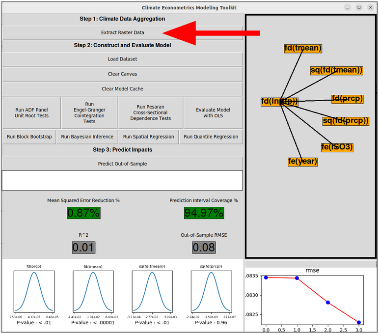
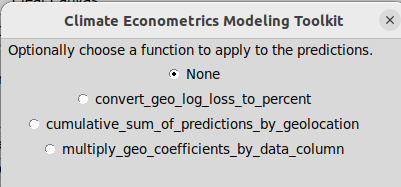

# Climate Econometrics Toolkit Interface Quickstart

This guide is designed to help users navigate the Climate Econometrics Toolkit user interface. The API is not covered here: for that, see the [API quickstart guide](api_quickstart.md), the [API Documentation](api_documentation.pdf) or one of the two example notebooks in "notebooks/".

## Starting the interface

Once you have the toolkit installed, open a Python shell and execute the following commands:

```
from climate_econometrics_toolkit import climate_econometrics_api as api
api.start_interface()
```

The interface should launch in a separate window.

## Interface Overview

The interface is primarily designed to help with constructing and evaluating climate econometric regression models. However, it also has some functionality to help with aggregating raster data and predicting on out-of-sample data.

### Aggregating Raster Data

<p align="center">

</p>

The "Extract Raster Data" button can be used for rudimentary raster extraction. This button will pop open a new window where the user can select:
1. one or more raster (NetCDF) files containing gridded climate data
2. a shape (.shp) file which represents the boundaries of the geographical regions in question
3. optionally, a weight (NetCDF) file with the same dimensions and granularity as the raster file(s) for population or cropland weights

Enter a number into the blank field that indicates the number of time periods to aggregate together. I am still working out how to handle unconventional conversions such as days-to-months (since there are an irregular number of days in each month). Hoewver, the most conventional case is aggregating daily or monthly data to the yearly level; enter "365" for days-to-years or "12" for months-to-years.

Finally, select an aggregation function, which defines how to group the aggregated data. "Mean" would be appropriate for temperature or humidity data, while "Sum" would be appropriate for precipitation data.

<p align="center">

</p>

The output will be written to `{cet_home}/raster_output`. Check the console for errors.

### Construct Climate Econometric Models

To get started, click "Load Dataset" and choose a .CSV file containing some panel data. This guide will use the file `data/GDP_climate_test_data.csv`.

You should be able to identify a time column and geography (panel) column; the system will prompt you to do so upon opening the dataset for the first time. Enter "year" for the time column and "iso_id" for the panel column.

<p align="center">


</p>

After loading the dataset, orange nodes representing columns in the loaded dataset will appear on the canvas. Note that files containing more than 100 columns are not supported. Models can be created by creating arrows from the covariates and effect nodes (e.g. fixed effects, time trends) to the dependent variable. There can only be one node receiving arrows; multiple regression is not supported.

The figure on the right shows a model regressing covariates quadratic temperature and quadratic precipitation on the first difference of the natural log of GDP per capita. Country and year fixed effects and quadratic country-specific time trends are also included.

**Node Movement**

To re-arrange nodes on the canvas, just click and drag them.

**Arrow Creation**

Click on a covariate (e.g. Temp, Precip). It will turn red. Click on the dependent variable, and an arrow will be created.

**Arrow Deletion**

Right click on an arrow to delete it. On a Mac, it may be a Command+Click depending on your configuration.

**Add Transformations and Effects**

Right click on an orange node to open the transformations and effects menu. Choosing an option from this menu will cause a new node to be created with the specified transformation or effect.

**Node Deletion**

Right click on a node and click "Delete Variable".

**Swap Node**

Sometimes you might want to swap in a different dependent variable. Rather than having to re-create all of the arrows, right click on either node and select "Swap with Other Variable", then left click on the other node and they will swap places, including all arrow connections

### Evaluate Climate Econometric Models

Once a model has been created, select the "Evaluate Model" button. The model will automatically be evaluated on out-of-sample data. Several metrics and distributions with p-values will appear on the left hand side, and the timeline on the bottom right will be updated.

<p align="center">


</p>

**Mean Squared Error Reduction %**: The difference in mean squared error between the constructed model and a model with only an intercept, evaluated against the same dependent variable. A higher percentage indicates a better model; a negative score indicates a poor model.

**Prediction Interval Coverage %**: The percentage of out-of-sample data points that fall within prediction intervals computed for each out-of-sample row. A value close to 95% indicates a model that adequately captures the uncertainty inherent in the parameters; a value more than 1% or so away from 95% indicates problems.

**R^2**: [The Coefficient of Determination](https://en.wikipedia.org/wiki/Coefficient_of_determination)

**Out-of-Sample RMSE**: [The Root Mean Squared Error](https://en.wikipedia.org/wiki/Root_mean_square_deviation)

The distributions in the bottom left show normal distributions computed from the mean and standard deviation values of the coefficient for each covariate, along with the p-values of each coefficient.

The timeline in the bottom right shows the results of all models that have been ran so far using the loaded dataset. These results will persist in the model cache even if the program is closed and re-opened with the same dataset. Clicking on a blue dot will restore the corresponding model, including the canvas state. Clicking on one of the metrics on the left side will alter the timeline to show the results by-model using the clicked metric. The Model ID can be copied to the clipboard by clicking the text above the timeline; this may be useful if you wish to switch to the use of the API for coefficient sampling and/or prediction.

Note that after running model evaluation, you can find:
1. the model results in `{cet_home}/model_results/{model_id}.csv`
2. a script to re-run the regression external to the interface in `{cet_home}/regression_scripts/{model_id}.csv`

### Coefficient Sampling

This software provides two built-in options for getting samples of coefficient values. This is useful for quantifying the uncertainty inherent in the regression model parameters, which can be used to seed downstream results with confidence bounds. Click the "Run Block Bootstrap" or "Run Bayesian Inference" buttons to begin the process. Results will be saved in the corresponding directory in `{cet_home}` and used automatically by the prediction function.

Note that both of these processes can be long-running, depending on the model; calling them from the API may be beneficial for practical reasons (i.e. you won't need to leave the interface window open on your machine for a long period of time).

### Computing Impacts

<p align="center">

</p>

The "Predict Out-of-Sample" button can be used to apply the constructed model to generate predictions on some other dataset. A typical use case would be predicting against aggregated General Circulation Model (GCM) data, which contains historical forcing or future projection data. This would allow for the computation of historical impacts or making predictions about the future. Note that the selected file must contain the same columns as the input dataset.

After selecting a dataset, you will be prompted to apply a post-processing function to the data. These functions are found in `src/climate_econometrics_toolkit/user_prediction_functions.py`. Selecting "None" means that the raw predictions will be available. Selecting a function will apply the function to the predictions. Currently, the only function available is `geotemporal_cumulative_sum`, which takes the global cumulative sum of the predictions along the axis of time. More functions can be added to `src/climate_econometrics_toolkit/user_prediction_functions.py` and will appear on this list in the interface.

<p align="center">

</p>

The output will be available in `{cet_home}/predictions`. If bootstrapping or Bayesian inference has been run for the selected model, the predictions will be of dimension MxN, where M is the number of coefficient samples and N is the number of rows in the out-of-sample data to be predicted on. If neither of these processes will be run, the predictions will be of dimension N.
