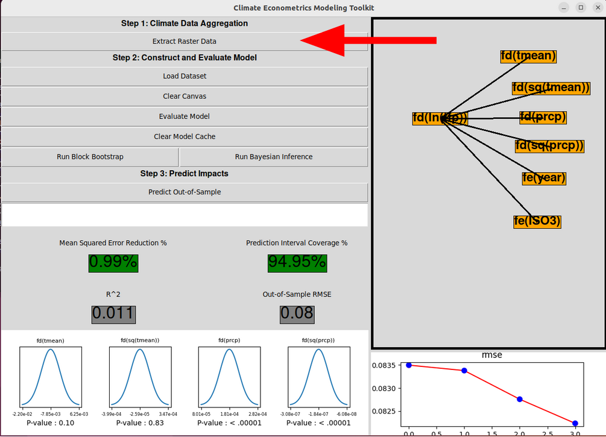
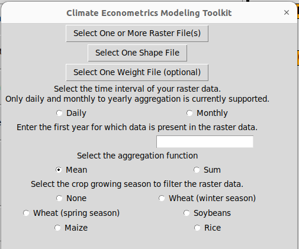
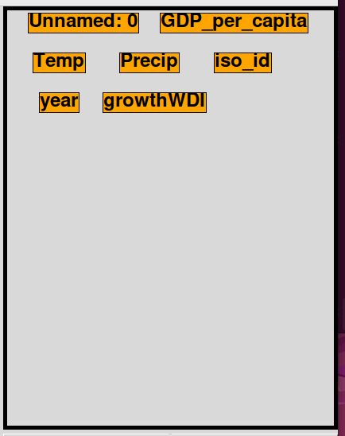
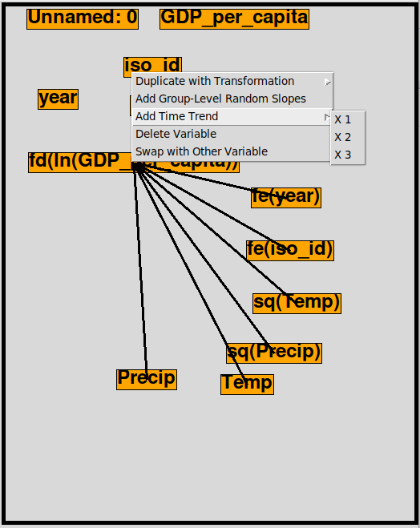
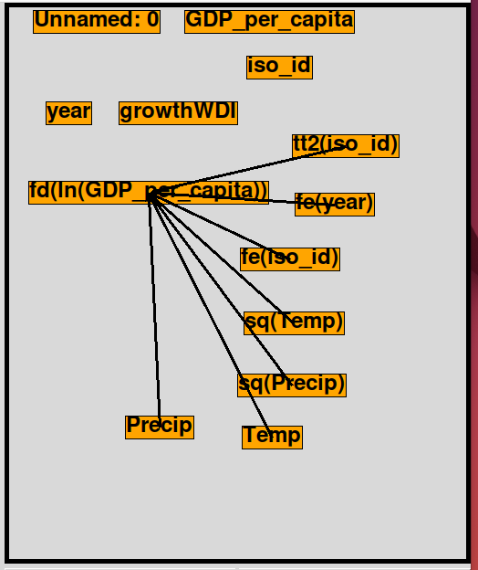

# Climate Econometrics Toolkit Interface Quickstart

This guide is designed to help users navigate the Climate Econometrics Toolkit user interface. The API is not covered here: for that, see the [API Documentation](api_documentation.pdf) or the [Ortiz-Bobea et al. reproduction](../notebooks/ortiz-bobea-reproduction.ipynb).

## Starting the interface

Once you have the toolkit installed, open a Python shell and execute the following commands:

```
from climate_econometrics_toolkit import climate_econometrics_api as api
api.start_interface()
```

The interface should launch in a separate window.

## Interface Overview

The interface is primarily designed to help with constructing and evaluating climate econometric regression models. However, it also has some functionality to help with aggregating raster data and predicting on out-of-sample data.

### Aggregating Raster Data

<p align="center">

</p>

The "Extract Raster Data" button can be used for rudimentary raster extraction. This button will pop open a new window where the user can select:
1. one or more raster (NetCDF) files containing gridded climate data
2. a shape (.shp) file which represents the boundaries of the geographical regions in question
3. optionally, a weight (NetCDF) file with the same dimensions and granularity as the raster file(s) for population or cropland weights

Enter a number into the blank field that indicates the number of time periods to aggregate together. I am still working out how to handle unconventional conversions such as days-to-months (since there are an irregular number of days in each month). Hoewver, the most conventional case is aggregating daily or monthly data to the yearly level; enter "365" for days-to-years or "12" for months-to-years.

Finally, select an aggregation function, which defines how to group the aggregated data. "Mean" would be appropriate for temperature or humidity data, while "Sum" would be appropriate for precipitation data.

<p align="center">

</p>

The output will be written to `{cet_home}/raster_output`. Check the console for errors.

### Construct and Evaluate Climate Econometric Models

To get started, click "Load Dataset" and choose a .CSV file containing some panel data. This guide will use the file `data/GDP_climate_test_data.csv`.

You should be able to identify a time column and geography (panel) column; the system will prompt you to do so upon opening the dataset for the first time. Enter "year" for the time column and "iso_id" for the panel column.

<p align="center">



</p>

After loading the dataset, orange nodes representing columns in the loaded dataset will appear on the canvas. Note that files containing more than 100 columns are not supported. Models can be created by creating arrows between 
